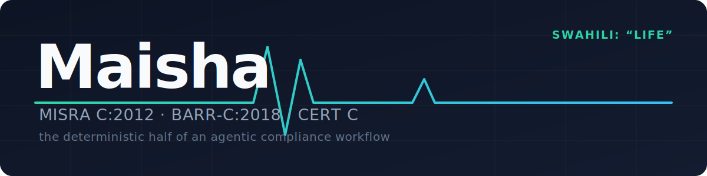

<p align="center"></p>

# Maisha

[](https://github.com/Kiransekar/maisha/actions/workflows/ci.yml)
&nbsp;[](https://github.com/Kiransekar/maisha/releases/tag/v0.2.0)
&nbsp;
&nbsp;

**An agent harness for MISRA C:2012, BARR-C:2018 and CERT C compliance — usable from any agentic IDE.**

> *Maisha* is Swahili for **"life."** Compliance standards like MISRA and CERT C
> exist because this is the software that flies planes, drives cars and runs
> medical devices — code where a defect costs lives, not uptime. The name is the
> goal the tool works toward. The CLI and package are `maishac` (*Maisha-for-C*).

> ⚠️ **Maisha is a workflow orchestrator and audit-trail layer, not a qualified/certified static-analysis tool.** Its findings do **not** by themselves satisfy tool-qualification requirements for DO-178C, ISO 26262 or IEC 62304, and running it is not a formal compliance certification. It is best used *upstream* of a qualified engine (see [Scope & Limitations](#scope--limitations)).

Maisha is not another linter. It is the *deterministic half* of an autonomous
compliance workflow. Your IDE's LLM (Claude Code, Cursor, Windsurf, Zed, anything
that speaks [MCP](https://modelcontextprotocol.io)) does the code edits; Maisha
does everything that must never hallucinate:

- **Scanning & evidence merging** — a zero-dependency native analyzer plus adapters
  for `cppcheck` (with its MISRA addon) and `clang-tidy` (`cert-*` checks). Findings
  from multiple analyzers that hit the same defect are fingerprint-merged into a
  single finding with reinforcing evidence (`analyzer: native+cppcheck`).
- **Proactive authoring (write it compliant the first time)** — two author-time
  surfaces, so an agent writes compliant code on the first pass instead of fixing
  it on a later scan:
  - `compliance_guidance` (CLI: `maishac guide "<topic>"`) — a compliant-pattern
    library: *before* writing code for a concern (dynamic memory, string copy,
    switch, recursion, integer overflow, …) it returns the idiom to **prefer**,
    the anti-pattern to **avoid**, **why**, and the MISRA/CERT/BARR-C rules it
    satisfies.
  - `compliance_check_snippet` (CLI: `maishac check`) — lints a draft *in memory,
    before it is written to a file*, returning violations, fix hints, and the
    compliant idiom to swap in. (Native lexical checks only — the syntactic
    subset, not whole-program rules; a clean snippet is not a compliance
    guarantee.)

  See [`AUTHORING_PLAYBOOK.md`](AUTHORING_PLAYBOOK.md) for the guidance → draft →
  check → rewrite protocol to hand your IDE agent.
- **Stable fingerprints** — findings are identified by
  `sha1(rule + file + normalized line content + enclosing function)`, *not* line
  numbers, so they survive edits, insertions and refactors across sessions.
- **Persistent memory** — a SQLite store per project (`.maishac/memory.db`)
  tracking finding lifecycle (open → resolved → regressed), every fix attempt and
  its outcome, false-positive suppressions, MISRA-style deviation records with
  justification/approver/expiry, and free-form project convention notes.
- **An engineered fix loop** — sessions with severity-ranked, file-grouped batches;
  regressions always jump the queue; each finding is briefed with the rule summary,
  a fix hint, strategies that *already failed* on it, relevant memory notes and
  cross-standard equivalents. Guard rails: iteration budgets, stall detection, and
  oscillation freezing (a finding that regresses twice is frozen as `needs_human`).
- **A verification gate** — a fix is not `resolved` just because the analyzer
  stopped flagging it. It enters `pending_verification` until a passing test run
  or an explicit human approval confirms it; semantic-risk and high-severity
  findings always require human sign-off. See [below](#the-verification-gate).
- **Reporting** — per-standard compliance matrices, a markdown report with a
  deviation register, SARIF 2.1.0 export with `partialFingerprints` for CI, and
  a **MISRA Compliance:2020 Guideline Compliance Summary** — the artifact a
  functional-safety assessor asks for: every enforced guideline classified
  Compliant / Deviations / Violations, tied to deviation permits, with the
  legality checks the framework mandates (a Mandatory guideline may not be
  deviated) and honest disclosure of which guidelines are *not checked*.

The three rule knowledge bases (**81 rules** — 31 MISRA C:2012, 20 BARR-C:2018,
30 CERT C) contain **original paraphrased
summaries** written for this project — no standard text is reproduced. For
authoritative wording you still need the official MISRA / BARR / SEI CERT documents.

---

## Scope & Limitations

**What Maisha *is*:**

- A **workflow orchestrator** for agent-driven compliance triage and fix loops.
- A **persistent audit-trail layer**: finding lifecycle, fix attempts, deviation
  records, suppressions, and a verification gate that records *how* every fix was
  confirmed (test run vs. human sign-off, and by whom).
- A **pre-certification cleanup** tool that catches and helps fix the obvious
  violations early — in the IDE loop, before code reaches a qualified engine.

**What Maisha is *not*:**

- **Not a qualified or certified analysis tool.** Its engines are the
  open-source cppcheck + clang-tidy + a native analyzer — none carry a tool
  qualification kit. DO-178C / ISO 26262 / IEC 62304 generally require the
  analysis tool *itself* to be qualified or proven-in-use; Maisha does not
  meet that bar and does not claim to.
- **Not complete rule coverage.** 81 curated rules across three standards is a
  fraction of MISRA C:2012 (180+ rules/directives with amendments) or CERT C.
  Detection is bounded by the underlying engines, not the curated set. Every
  covered rule and which analyzer backs it is listed in
  [COVERAGE.md](COVERAGE.md) (generated from the code, so gaps are explicit).
  A real-world run against the FreeRTOS kernel — with a measured false-positive
  rate and the tool bugs it surfaced — is in [BENCHMARKS.md](BENCHMARKS.md).
  Headline lesson: **pass your include paths to cppcheck/clang-tidy** with
  `--include`/`-I` (repeatable), or most of the substantive findings are
  configuration false positives. A from-scratch accuracy/reliability suite —
  ground-truthed fixtures, a full fix-loop simulation, SARIF import, CLI
  end-to-end and edge-case tests — is in
  [BENCHMARK-SUITE-REPORT.md](BENCHMARK-SUITE-REPORT.md).
- **Not a substitute for human review.** By default a fix is never marked
  `resolved` on a clean rescan alone — a passing test run or an explicit human
  approval is required, and semantic-risk / high-severity findings *always*
  require human sign-off (see [The verification gate](#the-verification-gate)).

**Recommended use for certification pipelines:** run Maisha's loop for early,
agent-driven cleanup, then hand off to a qualified engine (Astrée, Polyspace,
Helix QAC, Parasoft C/C++test, IAR C-STAT) for the evidence an auditor accepts.
Those engines emit SARIF, and `maishac import findings.sarif` layers Maisha's
loop, memory, verification gate and deviation register on top of their findings —
recognized MISRA/CERT ruleIds map onto the knowledge base, and imported findings
are never cleared by a native rescan.

**Rich SARIF mapping.** Import isn't lossy: a qualified engine's `codeFlows`
(the data-flow path *to* the defect) are parsed and surfaced in the agent
briefing, so a fixer sees how a defect flows, not just where it lands. Export
emits cross-standard equivalences as SARIF `reportingDescriptor.relationships`
(e.g. a MISRA rule linked to its CERT equivalent), with every relationship
target present as a descriptor. Maisha's own identity travels in
`partialFingerprints` (`maishac/v1`), and `startColumn` + code flows survive an
import → export round-trip, so re-exporting a qualified engine's findings
loses nothing.

---

## Install

Requires Python 3.10+.

```bash
pipx install maishac      # isolated CLI install (recommended)
# or
pip install maishac
```

This installs the `maishac` CLI and the `maishac` Python package. Verify with
`maishac --help`. To hack on Maisha itself:

```bash
git clone https://github.com/Kiransekar/maisha.git
cd maisha
pip install -e ".[dev]"   # editable install with pytest
```

Optional but strongly recommended external analyzers — native works with
zero dependencies, but cppcheck (MISRA addon) and clang-tidy (`cert-*`
checks) meaningfully increase coverage:

```bash
# Debian/Ubuntu
apt install cppcheck clang-tidy

# or, without root, anywhere pip works (prebuilt wheels, incl. Windows/macOS)
pip install cppcheck clang-tidy
```

Maisha degrades gracefully: any analyzer not on `PATH` is skipped and the
native analyzer always works. Run `maishac scan` once and check
`analyzers_used` in the output to confirm what's actually active.

## Quickstart (CLI)

```bash
cd your-firmware-project

maishac scan src/                  # one-shot scan, syncs memory
# headers outside src/ (e.g. a vendor SDK or FreeRTOSConfig.h)? forward them:
maishac scan src/ --include include/ --include vendor/sdk/inc

maishac findings --limit 20        # ranked open findings
maishac rule "MISRA 21.3"          # explain a rule + cross-standard refs

# The engineered loop (what an agent drives via MCP):
maishac session begin src/ --verification-policy human_gated
# -> {"session_id": "abc123...", ...} — use that id below
maishac session batch abc123       # next prioritized batch with briefings
# ...edit code (you or your agent)...
maishac session verify abc123      # rescan, diff, grade attempts, run the test gate
maishac approve <fingerprint> --by lead@example.com   # human sign-off on a verified fix
maishac session status abc123

maishac deviate "MISRA 19.2" --scope "drivers/**" \
    --justification "Union required for hardware register overlay mapping" \
    --approver lead@example.com --expires 2027-01-01
maishac suppress <fingerprint> --reason "false positive: macro expansion"
maishac note "This codebase uses FreeRTOS; heap_4 allocator is approved" --tags misra-21.3
maishac report --format sarif > compliance.sarif
maishac report --format misra-compliance > misra_compliance.md  # assessor deliverable
```

## Quickstart (any agentic IDE, via MCP)

Add the server to your IDE's MCP configuration (ready-made snippets in
[`integrations/`](integrations/)):

```json
{
  "mcpServers": {
    "maisha": {
      "command": "maishac",
      "args": ["serve"],
      "env": { "MAISHAC_PROJECT": "/path/to/your/project" }
    }
  }
}
```

Then tell your agent something like:

> Begin a Maisha compliance session on `src/`, work through batches until
> converged, record every attempt, and add deviations only where a fix is
> genuinely impossible.

The recommended agent protocol is documented in
[`AGENT_PLAYBOOK.md`](AGENT_PLAYBOOK.md).

## MCP tools

| Tool | Purpose |
|---|---|
| `compliance_scan` | Scan paths, merge analyzers, sync memory, return diff (new/persisting/resolved/regressed) |
| `compliance_list_findings` | Ranked open findings above a severity floor |
| `compliance_get_finding` | Full briefing for one fingerprint (history, failed strategies, notes) |
| `compliance_explain_rule` | Rule summary, severity, fix hint, cross-standard equivalents |
| `compliance_search_rules` | Keyword search across all three standards |
| `compliance_guidance` | **Before** writing code on a concern, get the compliant idiom to reach for (avoid/prefer/why + the rules it satisfies) — the author-time pattern library |
| `compliance_check_snippet` | Lint a draft snippet **in memory, before writing it** — proactive authoring aid; returns violations, fix hints, and the compliant idiom to swap in; stores nothing |
| `compliance_begin_session` | Baseline scan + session with budgets (`max_iterations`, `batch_size`) |
| `compliance_next_batch` | Next prioritized batch, regressions first, with per-finding briefings |
| `compliance_record_attempt` | Log the strategy used on a finding (auto-graded on verify) |
| `compliance_verify` | Rescan, diff, grade attempts, run the test gate, advance state machine |
| `compliance_approve_finding` | Human sign-off moving a `pending_verification` finding to `resolved` (required for semantic-risk / high-severity fixes) |
| `compliance_session_status` | Progress, iteration budget, state (`active`/`awaiting_verification`/`converged`/`stalled`/`budget_exhausted`) |
| `compliance_add_deviation` | MISRA-style deviation record (justification ≥ 15 chars enforced) |
| `compliance_suppress_finding` | Mark a fingerprint as false positive (reason required) |
| `memory_note` / `memory_search` / `memory_stats` | Project convention memory |
| `compliance_import_sarif` | Ingest an external engine's SARIF (qualified engine or cppcheck `--output-format=sarif`) into the same loop/memory/gate; **honors `result.suppressions`** so a team's existing triage/baseline carries over instead of resurfacing as fresh violations |
| `compliance_report` | Markdown, JSON, SARIF 2.1.0, or `misra-compliance` (MISRA Compliance:2020 Guideline Compliance Summary) |

## Architecture

```
┌──────────────────────────── your agentic IDE ───────────────────────────┐
│  LLM agent: reads briefings, edits code, records attempts               │
└──────────────▲──────────────────────────────────────────────────────────┘
               │ MCP (stdio)
┌──────────────┴──────────────  maisha  ──────────────────────────────┐
│ engine/    LoopEngine: sessions, batching, budgets, stall/oscillation   │
│ memory/    SQLite: findings, fix_attempts, deviations, suppressions,    │
│            notes, sessions  (.maishac/memory.db)                      │
│ analyzers/ native (0-dep) + cppcheck(+MISRA addon) + clang-tidy(cert-*) │
│            → fingerprint-deduped, severity-sorted evidence               │
│ rules/     MISRA C:2012 + BARR-C:2018 + CERT C KBs, fuzzy resolver,     │
│            cross-standard references                                     │
│ report.py  compliance matrix, markdown, SARIF 2.1.0                     │
└──────────────────────────────────────────────────────────────────────────┘
```

Design principles:

1. **Determinism where it matters.** Prioritization, verification, memory and
   budgets are code, not prompts. The LLM only does what LLMs are good at.
2. **Findings are identities, not line numbers.** Fingerprints keep history
   attached to the defect through refactors.
3. **The loop must terminate.** Iteration budgets, stall limits and oscillation
   freezing guarantee a session always ends in a well-defined state.
4. **Compliance is a process, not a scan.** Deviations and suppressions are
   first-class, auditable records — exactly as MISRA compliance expects.

## The verification gate

The trap Maisha guards against: the only judge of a fix is the same analyzer
whose blind spot may have created the finding. "The warning stopped firing"
rewards the syntactically minimal edit — often the one most likely to change
behavior at a boundary. Casting a signed sentinel (`-1` = "no limit") to
`uint32_t` to silence a signed/unsigned comparison warning turns "no limit" into
"an enormous limit" — the rescan passes, no static check ever catches it.

So a fix does **not** go straight to `resolved`. It enters
`pending_verification` and leaves only under the session's **`verification_policy`**:

| Policy | A pending fix becomes `resolved` when… |
|---|---|
| `analyzer_only` | the analyzer stops flagging it (⚠️ not recommended for compliance work) |
| `test_gated` | a configured `test_command` exits 0 |
| `human_gated` | a human calls `approve_finding` |

Default: `test_gated` if a `test_command` is configured, else `human_gated`.
Regardless of policy, **semantic-risk findings** (casts, comparisons, sign
conversions, control-flow changes) and **high-severity findings** always require
human approval — a green test suite that never exercises the sentinel case cannot
resolve them. Every resolution records how it was confirmed (`analyzer`/`test`/
`human`) and, for human sign-off, `approved_by`.

> **Set expectations accordingly:** the semantic-risk rule-category list is
> broad (it covers most of MISRA's essential-type, control-flow and
> switch-statement rules, plus CERT's `INT`/`FLP` families) — in practice,
> `test_gated` sessions on typical MISRA findings end up requiring human
> sign-off almost as often as `human_gated` does. A full end-to-end
> simulation confirmed a passing test suite auto-resolved **zero** of eight
> pending findings in one representative session — see
> [BENCHMARK-SUITE-REPORT.md §3.2](BENCHMARK-SUITE-REPORT.md#32-the-gate-is-more-conservative-than-it-looks).
> Budget human review time accordingly; don't expect `test_gated` to remove
> most of the review load.

```bash
maishac session begin src/ --verification-policy test_gated --test-command "make test"
# ...agent fixes, then:
maishac session verify <id>          # -> awaiting_verification if fixes need sign-off
maishac approve <fingerprint> --by lead@example.com
```

## Teams & concurrency

Project memory lives in a per-project SQLite file, `.maishac/memory.db`.

- **Gitignore it.** It is local, machine-specific state, not source — add
  `.maishac/` to `.gitignore` (this repo already does). To share state
  deliberately, export a `compliance_report` (SARIF/JSON), don't commit the DB.
- **Concurrent access.** The DB runs in WAL mode with a busy-timeout, so a CI
  scan and a local session can read/write without hard-blocking. `session begin`
  refuses to start a second session while one is already active on the same
  project (pass `--force` to override) so two runs don't race on finding state.

## Development

```bash
pip install -e . && python -m pytest tests/ -q
```

`examples/bad.c` is a deliberately non-compliant fixture exercising ~18 rules —
useful as a demo target.

## Contributing

Contributions are very welcome — especially to the community-extensible parts:
adding a coding-standard **rule**, an authoring **pattern** (compliant idiom), or
an **analyzer adapter** / SARIF-dialect mapping. None of these touch the engine.
See [`CONTRIBUTING.md`](CONTRIBUTING.md) for the how-to and the design invariants
to preserve, and [`CODE_OF_CONDUCT.md`](CODE_OF_CONDUCT.md). Good first issues are
labeled on the tracker.

## License / disclaimer

Rule summaries are original paraphrases; MISRA®, BARR-C and SEI CERT C are the
property of their respective owners. Maisha output does not constitute a
formal compliance certification.
